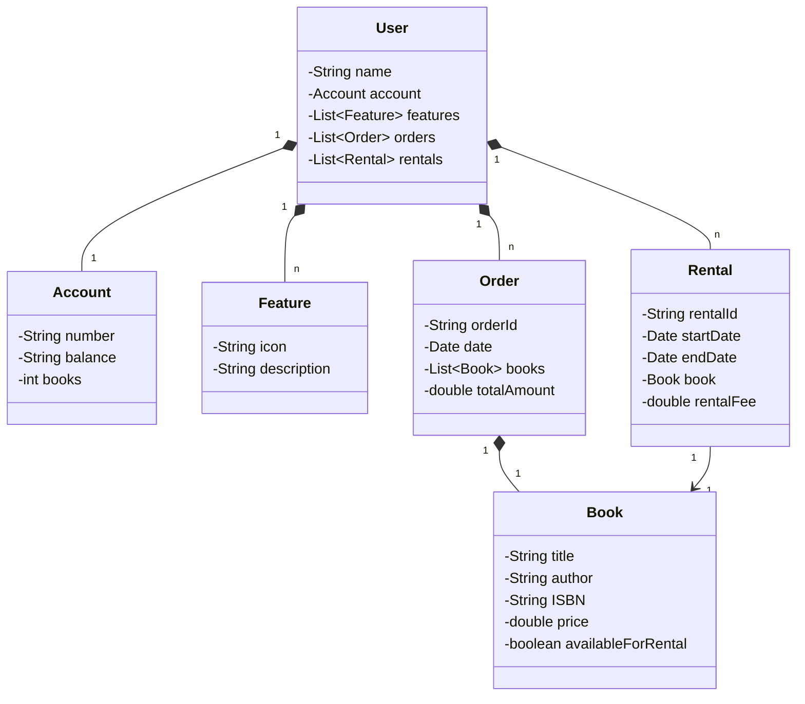

# Santander Bootcamp Desafio API RESTful

Java RESTful API criada para o desafio do Bootcamp da Santander.

## Diagrama de Classes

```mermaid
classDiagram
    class User {
        -String name
        -Account account
        -List~Feature~ features
        -List~Order~ orders
        -List~Rental~ rentals
    }

    class Account {
        -String number
        -String balance
        -int books
    }

    class Feature {
        -String icon
        -String description
    }

    class Book {
        -String title
        -String author
        -String ISBN
        -double price
        -boolean availableForRental
    }

    class Order {
        -String orderId
        -Date date
        -List~Book~ books
        -double totalAmount
    }

    class Rental {
        -String rentalId
        -Date startDate
        -Date endDate
        -Book book
        -double rentalFee
    }

    User "1" *-- "1" Account
    User "1" *-- "n" Feature
    User "1"*-- "n" Order
    User "1" *-- "n" Rental
    Order "1" *-- "1" Book
    Rental "1" --> "1" Book

```
